|Administración de Sistemas Informáticos en Red|
| - |
|Seguridad y Alta Disponibilidad|
|UD02 - Seguridad Física y Pasiva|
|Práctica 1 – RAID en Linux por CLI|

|Nombre y Apellidos|Marc Brines Bañuls|
| - | - |
|Curso|2 ASIX|

Práctica 1 – RAID en Linux por CLI ![ref1]![ref2]**Desarrollo**

Utilizando la práctica 1 como referencia, realiza los siguientes pasos para realizar la práctica.

*En todos los pasos de la práctica debes realizar capturas de pantalla explicando qué estás haciendo o escribir los comandos de consola que has utilizado detallando que hace cada uno.*

*A la hora de redactar utiliza el formato correcto, sé aseado y no hagas faltas de ortografía, en caso contrario se valorará la práctica negativamente.*

**1.- Crea un RAID1 llamado /dev/md1, con tres discos de 2 GB (recuerda que tendrás que  añadir  estos  discos  a  la  máquina  virtual).  Es  recomendable  seleccionar “Conectable en caliente” para simular la capacidad que tienen muchos servidores que permiten conectar y desconectar discos sin parar el servidor.**

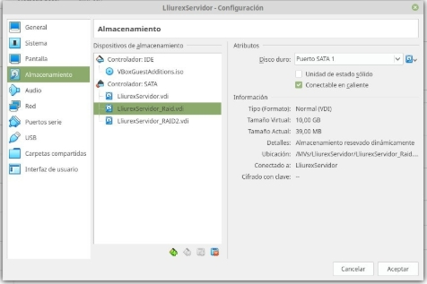

**2.- Crea una carpeta llamada “SAD”, en el escritorio y monta el RAID en dicho directorio. Añade algunos archivos al directorio.**

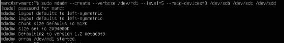

Primero creamos el RAID con los discos que hemos metido al principio, ahora vamos a crear la carpeta

|Administración de Sistemas Informáticos en Red|
| - |
|Seguridad y Alta Disponibilidad|
|UD02 - Seguridad Física y Pasiva|
|Práctica 1 – RAID en Linux por CLI|

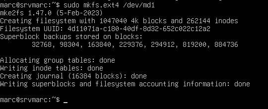

Le damos el formato al RAID, para poder trabajar con el.![ref1]![ref2]

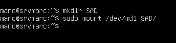

Creamos la carpeta SAD, y montamos el RAID en la carpeta que hemos creado.

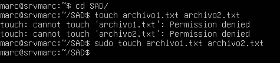

Entramos a la carpeta SAD para crear algunos ficheros dentro.

**3.- Ves a la configuración de VirtualBox i elimina la conexión de uno de los discos. Posteriormente comprueba como puedes acceder perfectamente al contenido de la carpeta aunque falte un disco. Ejecuta el comando mdadm --detail para observar qué está pasando y comenta lo que está pasando.**

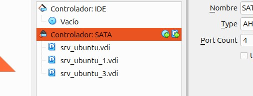

Quitamos un disco para provocar el fallo, con la máquina apagada desde el virtualbox.

|Administración de Sistemas Informáticos en Red|
| - |
|Seguridad y Alta Disponibilidad|
|UD02 - Seguridad Física y Pasiva|
|Práctica 1 – RAID en Linux por CLI|

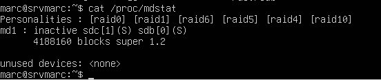

Vemos el estado del RAID, desde dentro una vez hemos quitado un disco del que lo formaban.![ref1]![ref2]

**4.- Añade más archivos o borra alguno de los archivos creados. Vuelve a añadir el disco al RAID y ejecuta otra vez mdadm --detail para observar qué está pasando y comenta lo que está pasando.**

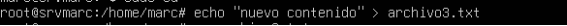

Añadimos más información dentro de este

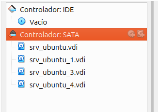

Volvemos a añadir el disco que anteriormente hemos quitado.

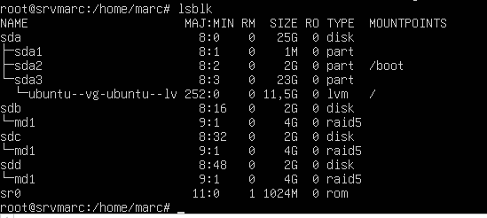

Comprobamos que lo hemos puesto correctamente.

|Administración de Sistemas Informáticos en Red|
| - |
|Seguridad y Alta Disponibilidad|
|UD02 - Seguridad Física y Pasiva|
|Práctica 1 – RAID en Linux por CLI|

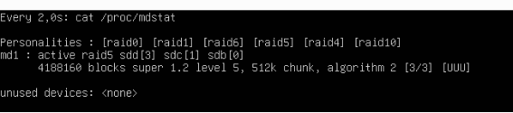

Volvemos a ver que está en activo.![ref1]![ref2]

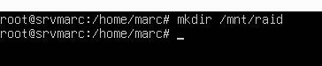

**5.- Modifica el fichero /etc/fstab para que el RAID se monte automáticamente en /mnt/raid cuando arranque el sistema.**

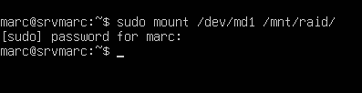

Montamos el raid en el directorio creado anteriormente.

Ahora editamos el fstab para poner la línea que se ve por pantalla, esto lo que hará es que al iniciarse la máquina, se montará automáticamente.

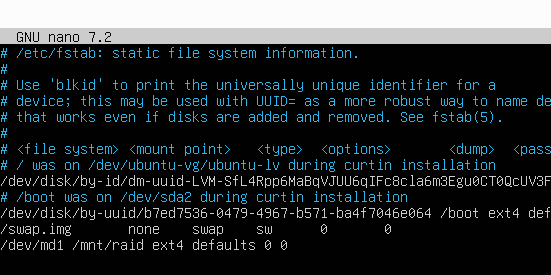

|Administración de Sistemas Informáticos en Red|
| - |
|Seguridad y Alta Disponibilidad|
|UD02 - Seguridad Física y Pasiva|
|Práctica 1 – RAID en Linux por CLI|

**El nombre del RAID debe permanecer aunque se reinicie la máquina (/dev/md1)![ref1]![ref2]**

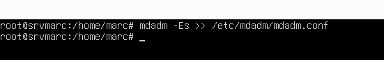

Aplicando el comando que se ve en la imagen, lo que haremos es que al reiniciar la máquina, se mantenga el nombre que le hemos dado.

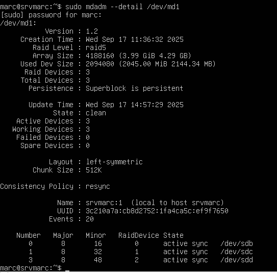

Una comprobación despues del reboot de la máquina

|Administración de Sistemas Informáticos en Red|
| - |
|Seguridad y Alta Disponibilidad|
|UD02 - Seguridad Física y Pasiva|
|Práctica 1 – RAID en Linux por CLI|

**6.- Elimina el RAID de la máquina (escribe los comandos utilizados). Reinicia y muestra![ref1]![ref2]  el  resultado  del  comando  mdadm  -–detail  /dev/md1  para  ver  que efectivamente si ha eliminado el RAID (captura)**

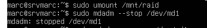

Desmontamos el RAID y lo paramos, para seguidamente eliminarlo.

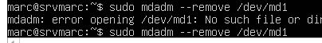

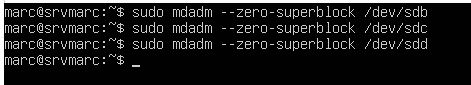

Este comando borrará la información del disco, por si se conecta algún disco a otro RAID que no nos de problemas.

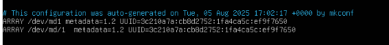

Borramos las lineas del fichero mdadm.conf.

Por ultimo comprobamos que lo hemos borrado bien y ya no existe, con el comando: “ sudo mdadm –detail /dev/md1”, y nos aparecerá como que ya no existe nuestro raid.

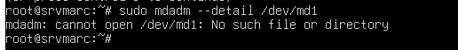
*Página ***6*** de ***6****

[ref1]: Aspose.Words.b36db84a-468f-405f-8d1b-b62c9130c0ff.001.png
[ref2]: Aspose.Words.b36db84a-468f-405f-8d1b-b62c9130c0ff.002.png
