|Sistemas Microinformáticos y Redes|
| - |
|Seguridad y Alta Disponibilidad|
|Unidad 1 – Introducción a la Seguridad y Alta Disponibilidad|
|Actividad 2 - Análisis de puertos|

|Nombre y Apellidos|Marc Brines Bañuls|
| :- | - |
|Curso|2 ASIX|

Actividad 2 – Análisis de puertos con nmap

**Enunciado**

1. Instala una máquina virtual con Xubuntu o alguna distro similar.

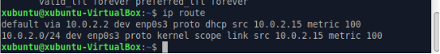

*Fig 1: Comprovació de la màquina en funcionament.*

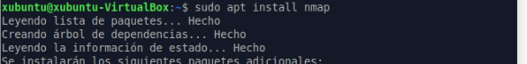

*Fig 2: Intalació de nmap.*

2. Busca  una  aplicación  (diferente  de  nmap)  para  el  análisis  de vulnerabilidades i comprueba si se puede instalar.

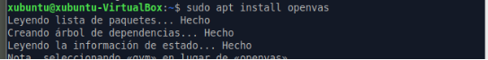

*Fig 3: Instale el openvas (ferramenta per a analisar vulnerabilitats)*

Si que la he pogut instal·lar, però m’ha tardat prou de temps en quan no

deuria de ser així.

3. Utilizando la herramienta nmap, realiza escanea los puertos que tiene abiertos tu ordenador

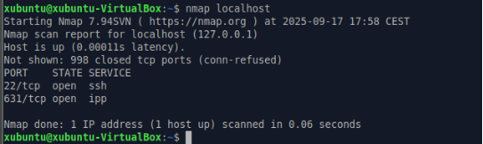

*Fig 4: Escaneig del meu ordenador*

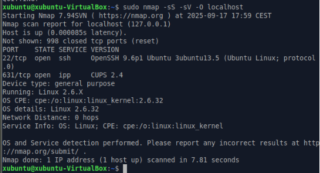

*Fig 5: Escaneig més detallat del meu ordenador.*

4. Instala  algún  servicio,  por  ejemplo  Apache,  y comprueba  con  nmap  que tienes el puerto referente a ese servicio abierto y haz que te muestre la versión utilizada.

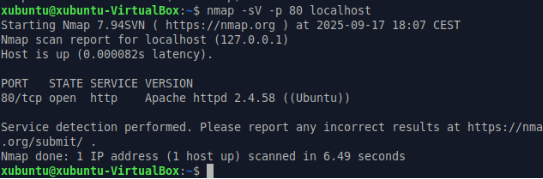

*Fig 6: Verificació del port 80 obert.*

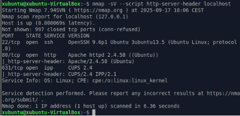

*Fig 7: Versió d’Apache*

5. Utilizando la herramienta nmap, realiza escanea los puertos que tiene abiertos el ordenador de un/una compañero/a

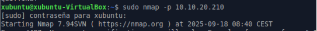

*Fig 8: Nmap a companyer ( parat per si passava algo a l’istitut )*

6. Realiza un escaneo de los puertos de todos los equipos de la red.

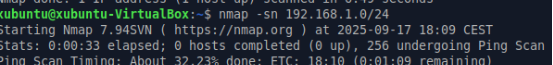

*Fig 9: Escaneig dels ports ( l’he parat per el que puguera passar.* Fet desde casa)

7. Realiza  un  escaneo  de  puerto  de  una  página  web  (por  ejemplo, marca.com)

   ¿Qué puertos tiene abiertos?

   NO

8. ¿Puedes averiguar las MAC de todos los equipos de la red con nmap?

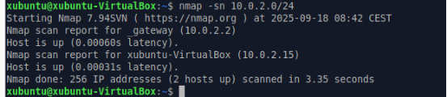

*Fig 11: Comando per a fer dit ejercici.*

9. ¿Puedes averiguar las IP de todos los equipos de la red con nmap?

Amb el comandament de la foto anterior ( fig 11 ), hi podem resoldre aquest

ejercici, no ho pose en pràctica ja que estic treballant sobre la red de l’istitut.

10. Utiliza la herramienta Legion para realizar el escaneo de tu PC. ¿Qué datos obtienes?

( Faig explicació perque no he fet captures de l’instalació )

Actualitzem y descarreguem els que ens fa falta, seguidament clonem el

repositori de git, agafant el https de dins de la web de git. Entrem a la carpeta on sens descarrega i executem com un script el legion.

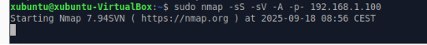

11. ¿Tiene alguna vulnerabilidad CVE?
11. Utiliza  nmap  para  ver  la  vulnerabilidades  de  tu  ordenador  ¿Tiene alguna CVE?

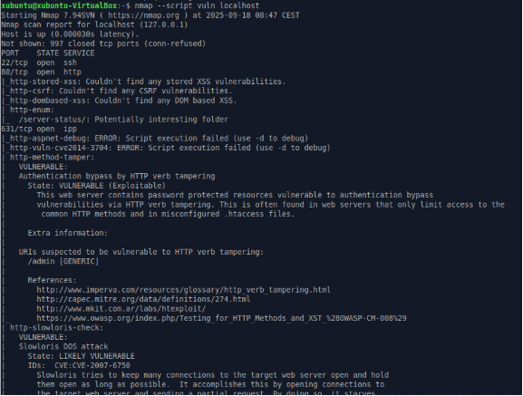

*Fig 13: Hi busquem vulnerabilitats al nostre ordenador.*

13. Investiga  ¿Qué  es  <https://www.shodan.io/>  ?

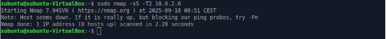
*Página **1** de **1***
