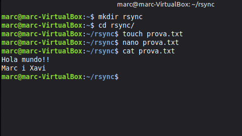
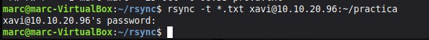
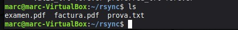
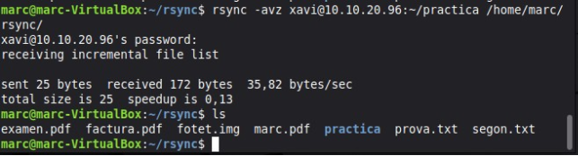
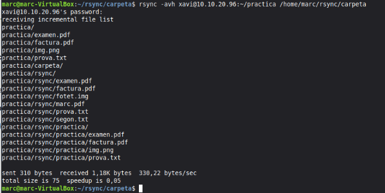
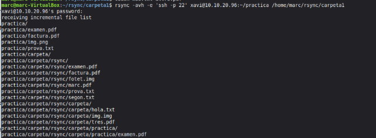
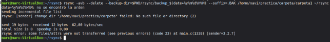

RSYNC

Marc Brines Bañuls 2 ASIX SAD

Abans de començar, creem el directori sobre el que anem a treballar ( per a no fer-ho en el usuari ) 

*Fig 1: Creació de directori.*

Amb el següent comandament anem a enviar a la carpeta pràctica, ubicada al ordeador del meu company, tots aquells  fitxers del lloc on hem trobe, que s’acaben amb .txt.

*Fig 2: Comandament*

Ell m’ha fet el mateix a mí i anem a veure els fitxers que m’ha passat en cas de haver-ho fet bé.

*Fig 3: Comprovació.*

Ara anem a: copiar la carpeta pràctica, que es troba al ordenador del meu company, a la meua direcció home.

*Fig 4: Comandament.*

Marc Brines Bañuls 2 ASIX SAD

2

Ara anem a fer que el meu ordenador es connecte al de Xavi, una vegada allà agafa la capeta seua “pràctica” i la copies a la meua direcció.

*Fig 5: Comandament.*

Ara hem fet el mateix, pero establint-li un port, en aquest cas, com no l’hem cambiat, li fiquem el que ja agafa per defecte que es el 22.

*Fig 6: Comandament.*

Marc Brines Bañuls 2 ASIX SAD

3
