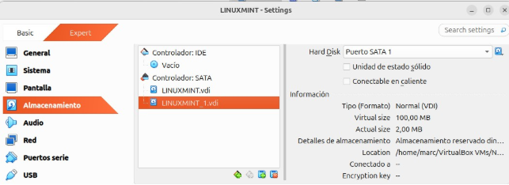
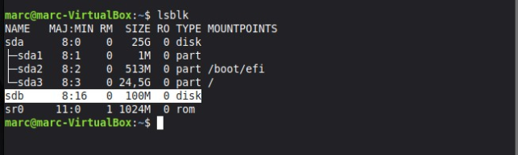
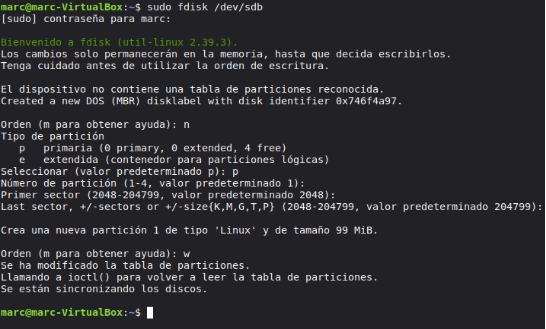
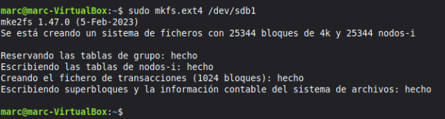
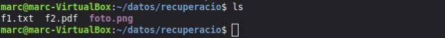
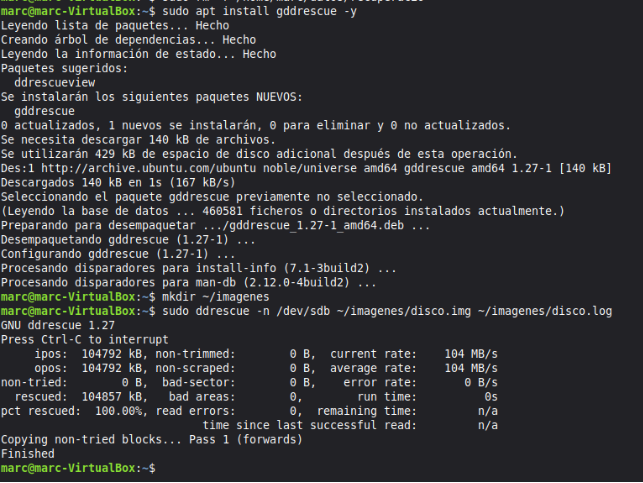
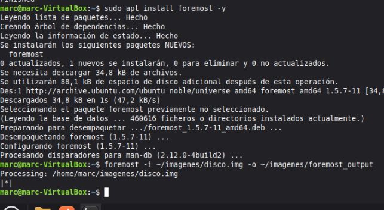
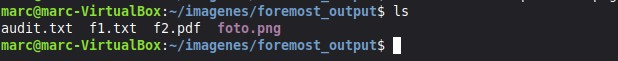

RECUPERACIÓ DE DADES

Primer que res vaig a gastar la màquina de linux mint 22.2., que ja hi tinc instal·lada al meu ordenador, continuant amb el primer pas, anem a afegir un disc dur de 100MB.

*Fig 1: Disc afegit.*

Una vegada afegit el disc al sistema, entrem per tal de localitzar-lo i donar-li format per treballar amb ell.

*Fig 2: Selecció de disc.*

*Fig 3: Formateig del disc (valors per defecte)*

Una vegada hem creat les particions anem a donar-li format ext4 a la nostra partició.

*Fig 4: Format de la partició.*

Creem el punt de montatge i montem la partició creada dins del directori que hem creat anteriorment.

*Fig 5: Montatge de la partició.*

*Fig 6: Creació directori recuperació.*

*Fig 7: Fitxers creats a “recuperació”.*

*Fig 8: Borrem el directori.*

Amb l’ajuda de la IA, instale el programa per tal de generar una imatge de disc.

*Fig 9: Instal·lació del generador d’imatges de disc.* Instalem ferramenta de recuperació i iniciem la recuperació també.

*Fig 10: Recuperació.*

*Fig 11: Recuperació dels fitxers. (audit.txt NO se el que es...)*
